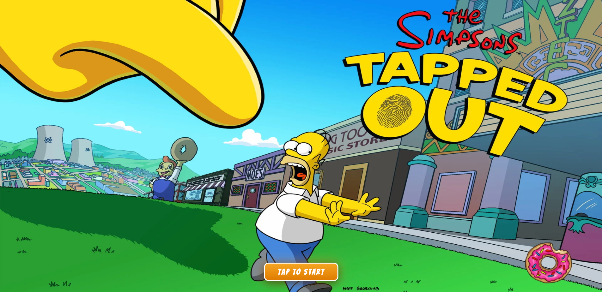
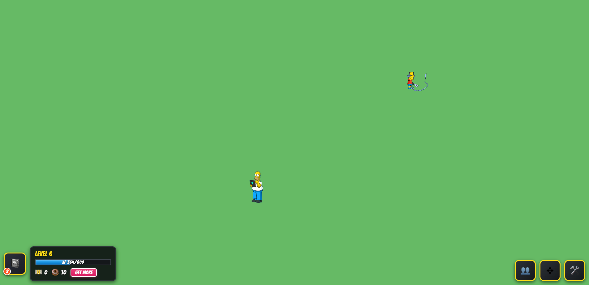

# Simpsons Tapped Out Web

An unofficial rewrite of *The Simpsons: Tapped Out* in Rust for the web.

This project is not a style mockup or fan theme. It is a browser-based rebuild of the game experience, with the core logic written in Rust and compiled to WebAssembly, then driven by a lightweight JavaScript shell and HTML/CSS UI.

## Screenshots

### Home



### Game



## What this project includes

- A Rust game core compiled to WebAssembly
- A WebGL2 renderer for drawing the game world
- Sprite-based character rendering and animation
- Browser input handling for mouse, touch, and keyboard events
- A menu state and a playing state
- Homer and Bart character logic
- Original character sprites and animations currently included for Homer Simpson and Bart Simpson
- Task selection menus for each character
- Basic job timers, movement, and reward handling
- A HUD with cash, donuts, XP, and quest controls

## How it works

The application is split into a few layers:

- Rust handles the game state and rendering logic
- JavaScript loads the WebAssembly module, preloads textures, and wires browser events into the game
- HTML provides the canvas and UI shell
- CSS styles the HUD, menus, loading screen, and overlays

The game starts in a menu state, then transitions into gameplay when the user taps or clicks the start button. From there, the player can interact with Homer and Bart, assign chores, and watch the reward UI update as jobs complete.

## Project Structure

- `src/` contains the Rust source
- `web/` contains the browser UI, assets, and JS glue code
- `home.png` and `game.png` are the screenshots shown above
- `build.sh` builds the Rust code to WebAssembly

## Requirements

- Rust toolchain
- `wasm-pack`
- Bun

## Running Locally

### Build the WebAssembly bundle

```bash
bun run build
```

This compiles the Rust crate and outputs the WASM package into `web/pkg/`.

### Build and start the local web server

```bash
bun run dev
```

## Build Scripts

- `bun run build` builds the WASM bundle
- `bun run dev` builds the WASM bundle and starts a local server

## Rust Entry Points

- `src/lib.rs` exposes the WASM bindings
- `create_game()` constructs the game from the canvas element
- `homer_texture_manifest()` and `bart_texture_manifest()` return the texture lists used by the loader

## Browser Flow

- `web/index.html` defines the UI shell and canvas
- `web/main.js` initializes WASM, loads textures, and forwards user input
- `web/style.css` and `web/style_tasks.css` handle the layout and presentation

## Notes

- The project uses WebGL2 for rendering
- The loading screen preloads the required character textures before gameplay begins
- The JS layer handles task popups, HUD updates, and reward notifications
